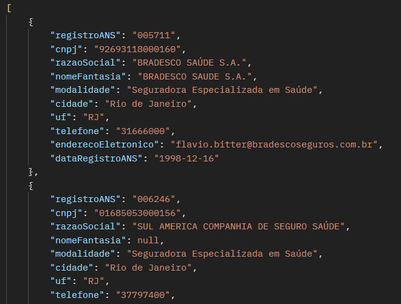
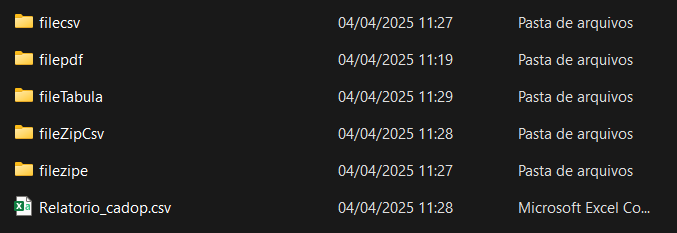

# Data Transform - Guia de Execução do Projeto

## 📌 Introdução
Bem-vindo ao projeto **Data Transform**! Este guia ajudará você a configurar e executar todas as etapas necessárias para rodar o sistema corretamente.

---

## 🔧 Requisitos
Antes de iniciar, certifique-se de que possui os seguintes requisitos instalados:

- 🦓 **Sistema operacional:** Windows
- 💪 **Docker Desktop** (para rodar o banco de dados PostgreSQL)
- 🏰 **Maven** (para compilar e rodar o backend Spring Boot)
- 🌐 **Node.js e npm** (para executar o frontend Vue.js)
- 🖥 **Git** (para clonar o repositório do projeto)
- ☕ **JDK 22** (para rodar o backend em Java)

---

## 🚀 Passos para Execução

### 🏫 Passo 1: Criar o Container PostgreSQL no Docker
Abra um terminal **(cmd ou PowerShell)** e execute o seguinte comando para iniciar o banco de dados PostgreSQL no Docker:

```bash
docker run -d --name mydb -p 5432:5432 \
  -e POSTGRES_USER=myuser \
  -e POSTGRES_PASSWORD=mypassword \
  -e POSTGRES_DB=mydb \
  postgres
```

Este comando criará um container do PostgreSQL acessível na porta **5432**, com o usuário `myuser` e senha `mypassword`.

---

### 📚 Passo 2: Clonar o Repositório do Projeto
Abra um terminal e execute:

```bash
git clone https://github.com/RichardJanebo/desafio.git   
```

Depois, entre na pasta do projeto:

```bash
cd SEU-REPOSITORIO
```

---

### 🛠️ Passo 3: Configurar o Backend (Spring Boot)
Acesse a pasta do backend e execute o comando para rodar a aplicação:

```bash
cd data-transform
mvn spring-boot:run
```

Isso iniciará a API backend, responsável pelo processamento dos dados.

---

### 🎨 Passo 4: Configurar o Frontend (Vue.js)
Abra um novo terminal, acesse a pasta do frontend e execute os comandos abaixo:

```bash
cd src/main/vue/front
npm install   # Instala as dependências
npm run dev   # Inicia o servidor Vue.js
```

Agora, a aplicação estará disponível em `http://localhost:5173/`.

---

### 🔄 Passo 5: Executar os Processos

Agora você pode interagir com o frontend e executar os seguintes processos:

1. **Web Scraping** - Baixa os anexos e salva na pasta `downloads`.
2. **Transformação de Dados** - Extrai informações e cria planilhas dentro da pasta `downloads`.
3. **Teste de Banco de Dados** - Baixa zips dos últimos 2 anos e cria a planilha das operadoras.

Cada botão no frontend executará um desses processos automaticamente.

---

### 🛠️ Passo 6: Executar o Arquivo BAT (Importação para o Banco)

Depois de processar os dados, execute o script BAT para importar os arquivos para o banco de dados PostgreSQL:

```bash
cd data-transform
./init.bat
```

Isso copiará os arquivos para dentro do Docker e inserirá os dados no PostgreSQL.

---

### 👀 Passo 7: Testar os Endpoints no Postman

Agora, você pode testar os endpoints da API pelo **Postman** ou diretamente no navegador.

#### 💡 Operadoras Ativas

**Base URL:** `http://localhost:8080/api/v1/operadoras-ativas`

- **Top 10 Despesas no Trimestre:**
  ```http
  GET /top10/trimestre
  ```
- **Top 10 Despesas no Ano:**
  ```http
  GET /top10/ano
  ```
- **Buscar Operadoras por Filtros:**
  ```http
  GET /search?registroANS=XXXX&cnpj=YYYY&razaoSocial=ZZZZ
  ```

#### 📂 Processamento de Dados

**Base URL:** `http://localhost:8080/`

- **Iniciar Web Scraping:**
  ```http
  GET /webScrapping
  ```
- **Transformar Dados:**
  ```http
  GET /transformData
  ```
- **Testar Banco de Dados:**
  ```http
  GET /dataBaseTest
  ```

---

### 🚪 Passo 8: Interagir com a Página
Agora que tudo está rodando, acesse a interface do sistema e interaja com os botões para realizar pesquisas e manipular os dados coletados.

📄 **Backend:** `http://localhost:8080/`
🌐 **Frontend:** `http://localhost:5173/`

---

## 📈 Conclusão
Se você seguiu todos os passos corretamente, o projeto estará pronto para uso! 🚀

Caso tenha problemas, verifique os logs do terminal e confira se todos os serviços estão rodando corretamente.

💉 **Dica**: Para parar ou reiniciar o banco de dados no Docker:

```bash
docker stop mydb
```

Para iniciar novamente:

```bash
docker start mydb
```

---

💡 **Dúvidas ou sugestões? Contribua no repositório!** 😊

EX: de Json retornados 

Como fica as pastas após tudo feito:

